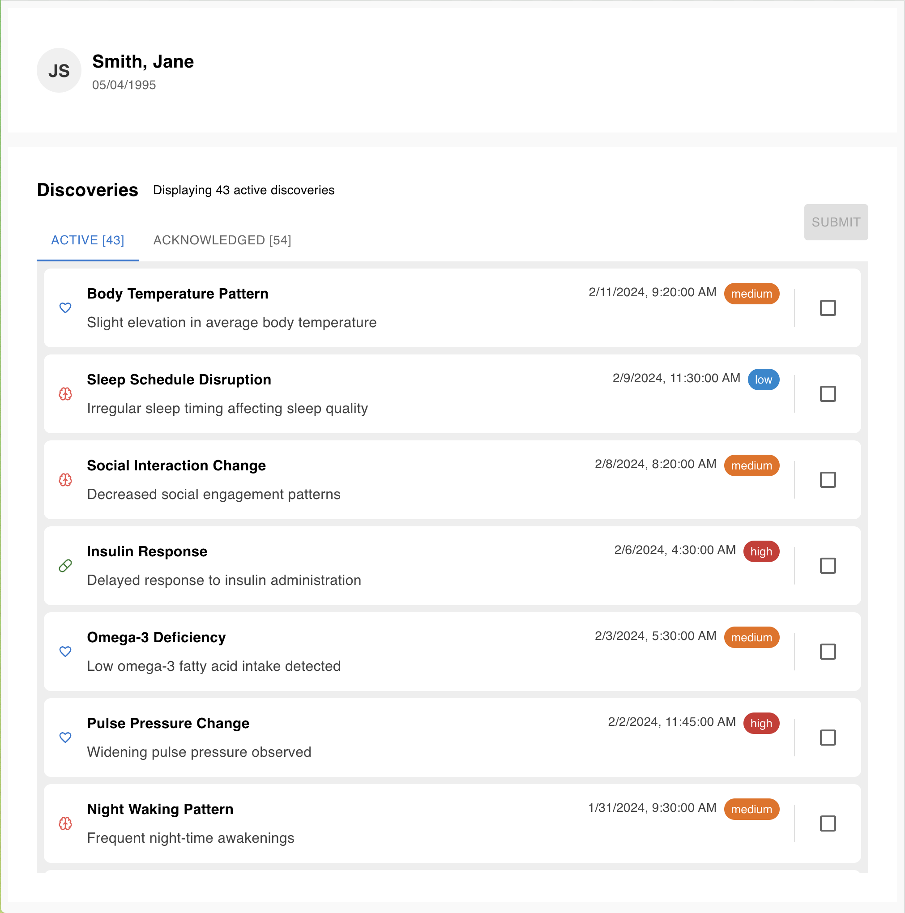
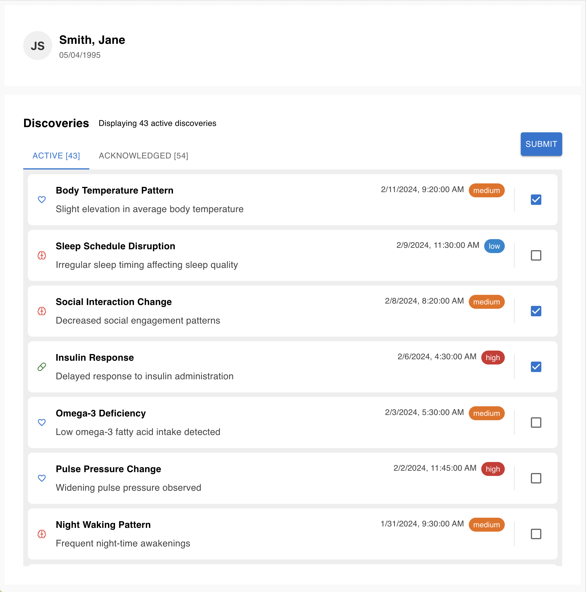
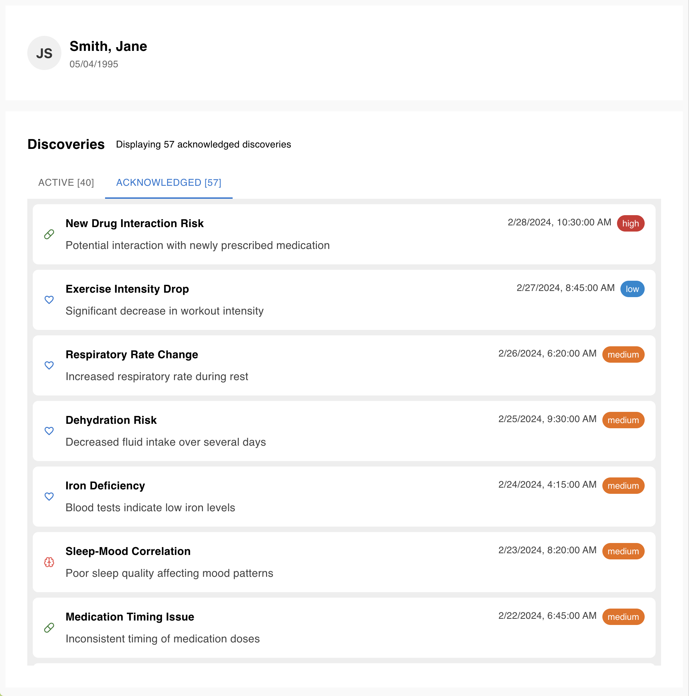

# Percipio Front End Take Home Challenge

## Expectations

Please make note of the following expectations before you begin:

1. **This challenge consists of two pieces - (1) the base challenge, and (2) the enhancement**. We expect you to complete the base challenge and _only one_ of the enhancements from the list further down this readme.
2. **We will only assess you for the code you submit that completes the base challenge and one enhancement**. Please indicate in your submission which enhancement you completed.
3. **We expect you to spend ~2-4 hours on this challenge in total**. This is not a hard limit, but is meant to set expectations about how much work we are asking of you. If you’re unable to complete all the requirements in that time frame, feel free to explain in your write-up any of the thoughts or plans you would have completed with more time.
4. **We do not expect a full scale application with working navigation, complex animations, etc. You should only develop what you need in order to accomplish the goal we've given.**
5. The purpose of this challenge is to get a sense of your work, and to serve as the focal point of your technical interview. Expect the code you submit to come up in your technical interview.

## The Process

1. Start by using this template. You can do so by clicking the "Use this template" button in the top right of the GitHub UI, then "Create a new repository". Make this new repo private.
2. Read the details about the test below and complete the test.
3. Create a branch to complete the base challenge. When you are ready to do the enhancement, create a new branch off of your base challenge branch.
4. When you are ready to submit, open two PRs as outlined below.
5. Send an email to the person that sent you this challenge and they will coordinate with you to determine what list of reviewers to invite to your repository.
6. We will review your work. If you are chosen to progress, we will schedule a technical interview where you will meet some of our engineers and discuss this test.

### Submitting the Test

When you are ready to submit the challenge, please open two PRs within your copy of the repository. One PR should consist of your solution for the **base challenge**. The second PR should consist of your solution to the **enhancement** you’ve selected, which should be a PR into your base challenge branch.

In both of your PR descriptions, please include:

1. Relevant screenshots/screen-recordings.
2. A brief description of your submission.
3. Anything else you might like us to know as we review your submission.

In the PR description for your enhancement, please state which enhancement you completed.

## The Test

### Background Information

For this challenge, let’s pretend that we have built a system that receives health data from a patient, like their heart rate and blood pressure, and will output “discoveries” about a patient. A discovery is a piece of data that represents an insight into a patient’s health. For example, if a patient has a resting heart rate of 60 beats per minute, and in a few weeks the patient’s resting heart rate increases to 65 bpm, a discovery might be generated that says, “Patient’s resting heart rate has increased from 60 bpm to 65 bpm.”

While our system does generate discoveries, these discoveries are not being displayed anywhere, therefore they cannot be viewed. Our clinicians have asked us to build an interface where discoveries can be viewed. Once a discovery has been reviewed by a clinician, the clinician should be able to move the discovery over to an “Acknowledged” list.

The “Acknowledged” list will signal to other clinicians that the discovery has been reviewed and validated by another clinician.

### The Assignment

Here are the asks we have for you:

### 1. Base Challenge: Acceptance Criteria

1. As a user, I want to see the full list of 100 discoveries, displayed in reverse-chronological order (most recent first).
   - Please use the mocks below as a guideline - however, we don't expect exact, pixel-perfect replication of the mock!
   - You can use the following icons and colors based on discovery `type`:
     - physiology: `<MdFavoriteBorder />` set to color `primaryMain`
     - brain: `<LuBrain />` set to color `errorLight`
     - medication: `<LuPill />` set to color `successMain`
2. As a user, I should be able to select one or multiple discoveries so that I can indicate which discoveries have been reviewed for the patient.
3. When at least one discovery is selected, the “Submit” button should be enabled.
4. Clicking “Submit” should move all selected discoveries to the "Acknowledged" list.
5. The acknowledged discoveries list should persist after a page refresh.

#### Mocks:





### 2. Enhancement

Please select one Enhancement from the list below to complete.

#### #1: Implement infinite scroll with lazy loading

As a user, I should initially see a list of 25 discoveries. As I scroll, more discoveries should be loaded into the screen.

#### #2: Implement Pagination

As a user, I should initially see a list of 25 discoveries. There should be page numbers at the bottom of the container. Clicking on a page number should show that set of discoveries. Each page should show a maximum of 25 discoveries.

#### #3: Create a batch update endpoint

As a user, I want the ability to update multiple discoveries at once through a batch update feature so that I can save time and avoid the inefficiency of updating discoveries one at a time. The UI should be wired to use the new batch update endpoint for seamless functionality.

#### #4: Create a summary of the discoveries list

As a user, I want a brief summary of 2-4 sentences highlighting general health trends based on the discoveries in the Acknowledged list so that I can quickly understand key insights about the patient’s health. This summary should be displayed above the list of discoveries. You are welcome to use AI or other tools not included in this repo to accomplish this task.

An example of a summary could be:

```
“The patient has an elevated blood pressure of 160/90mmHg. Additionally, the patient’s Pulse Rate is 59, deviating -5.1% from the historical average of 62.2.”
```

#### #5: Add some animations/transitions on the lists

As a user, I want animations, transitions, or other CSS effects added to the lists so that the experience feels more fluid and enjoyable.

#### #6: Add Dark Mode and the ability to toggle between Light and Dark Mode

As a user, I should be able to toggle between Light and Dark mode.

#### #7: Add test coverage

As a developer, I want to add UI test coverage, e2e tests, or any other necessary tests so that I can ensure my submission works as expected.

## Additional Notes:

Please make note of the following:

1. The API provides various endpoints to interact with Discoveries data. Neither the data nor the endpoints need to be updated to successfully complete the base challenge.
2. Please use [MUI](https://mui.com/) components and [react-icons](https://react-icons.github.io/react-icons/icons/md/) to build the UI for this challenge.
3. All packages needed to complete the **base challenge** are included in the package.json. You should not need to install any new dependencies to complete the base challenge, but you are welcome to install and use other dependencies if you would like to.
4. We are not expecting you to do any work outside of building the interface for the “Active” and “Acknowledged” lists, wiring up the “Submit” button, and completing one enhancement.
5. None of the code that you submit will be used in any way in our actual codebase - but this challenge is representative of the _type_ of work you may be asked to do day-to-day.

## Getting Started

Before you start coding, make sure you have the following installed on your machine:

1. `nvm` or Node.js
2. `pnpm` (we recommend installing with Corepack)
3. (Optional) nx for running workspaces

Once you’ve got the repo set up, use nvm to install and path the correct Node version based on the .nvmrc in this repo:

```
nvm install
nvm use
```

Then, install packages from the monorepo root:

```
pnpm i
```

And then you can run both the API and web app together, concurrently, by running the following script from the root directory:

```
pnpm run start:dev
```

You should be able to see the app on `http://localhost:5173/` and the API documentation at `http://localhost:3000/api`.

There's more information about how to run the [API](./apps/api/README.md) and [UI](./apps/web/README.md) in their respective directories.
